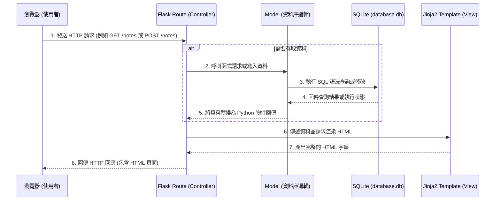

# 系統架構文件 - 讀書筆記系統

本文件根據產品需求文件 (PRD) 定義讀書筆記系統的技術架構與資料夾結構。

## 1. 技術架構說明

本專案採用輕量且易於擴展的技術組合，並遵循經典的 MVC (Model-View-Controller) 設計模式，確保程式碼結構清晰且易於維護。

### 選用技術與原因
- **後端框架：Python + Flask**
  - 原因：Flask 是一個輕量級的 Web 框架，適合快速開發中小型應用程式。其靈活性讓開發團隊能專注於核心業務邏輯。
- **模板引擎：Jinja2**
  - 原因：內建於 Flask 中，能順暢地將後端資料注入 HTML 模板，負責前端頁面的動態渲染。我們採用 Server-Side Rendering (SSR)，不進行前後端分離，以降低開發初期複雜度。
- **資料庫：SQLite**
  - 原因：作為輕量級關聯式資料庫，SQLite 不需要額外的伺服器設定，檔案即資料庫，非常適合 MVP 階段與本地端快速開發與測試。
- **前端呈現：HTML / Vanilla CSS**
  - 原因：使用純粹的 HTML 與 CSS 建構 UI，不引入大型前端框架，保持專案輕量。

### Flask MVC 模式說明
我們將系統劃分為三個主要層級：
- **Model (資料模型)**：負責定義資料庫的結構 (Schema) 以及與資料庫的所有互動邏輯。它隱藏了資料存取的細節，提供簡潔的 API 給 Controller 呼叫（例如：新增筆記、搜尋書單）。
- **View (視圖)**：負責呈現使用者介面。在這裡指的是 `Jinja2` HTML 模板，負責接收 Controller 傳遞的資料並渲染成最終的網頁。
- **Controller (控制器)**：在 Flask 中由 **Routes (路由)** 扮演此角色。負責接收使用者的 HTTP 請求、呼叫對應的 Model 處理資料邏輯，並決定要渲染哪一個 View 回傳給使用者。

---

## 2. 專案資料夾結構

以下為專案的建議資料夾結構：

```text
web_app_development2/
├── app/                        # 應用程式主目錄
│   ├── models/                 # Model 層：資料庫模型與操作
│   │   └── note_model.py       # 定義書籍與筆記的資料庫操作邏輯
│   ├── routes/                 # Controller 層：Flask 路由與視圖函數
│   │   └── note_routes.py      # 處理筆記相關的請求 (CRUD, 搜尋)
│   ├── templates/              # View 層：Jinja2 HTML 模板
│   │   ├── base.html           # 共同的網頁佈局 (Navbar, Footer 等)
│   │   ├── index.html          # 首頁 / 筆記列表頁
│   │   ├── create.html         # 新增筆記頁面
│   │   └── detail.html         # 筆記詳細內容與編輯頁面
│   └── static/                 # 靜態資源檔案
│       ├── css/
│       │   └── style.css       # 全域與各頁面樣式
│       └── js/                 # 若有需要，放置少量輔助用的 JavaScript
├── instance/                   # 存放不應加入版控的實例資料
│   └── database.db             # SQLite 資料庫實體檔案
├── docs/                       # 專案文件目錄
│   ├── PRD.md                  # 產品需求文件
│   └── ARCHITECTURE.md         # 系統架構文件 (本檔案)
├── app.py                      # Flask 應用程式入口，負責初始化 app 與註冊路由
└── requirements.txt            # Python 套件依賴清單
```

---

## 3. 元件關係圖

以下展示使用者發出請求後，系統各元件之間的互動流程：



---

## 4. 關鍵設計決策

1. **採用 SSR (Server-Side Rendering) 取代前後端分離**
   - **原因**：為了快速驗證 MVP 核心功能（筆記、評分、查詢），不需要處理複雜的跨域請求 (CORS)、前端狀態管理與 API 驗證。Flask + Jinja2 能夠以最快速度產出可用的頁面。
2. **單一資料庫表 (或精簡的關聯)**
   - **原因**：在 MVP 階段，書籍資訊（書名、作者）與個人筆記（心得、評分）可以先設計在同一張 `notes` 資料表中。若未來需要加入「不同使用者」或「共用書庫」，再拆分為 `users`、`books`、`notes` 等多張表。這樣能加快初期開發速度。
3. **將路由與資料庫邏輯分離 (routes/ vs models/)**
   - **原因**：避免將所有的 SQL 語法與資料處理邏輯塞在 Flask 的 `app.route` 函式中。建立獨立的 `models` 目錄，能讓程式碼更容易測試與重複使用（例如，搜尋功能與列表功能可能呼叫同一個 Model 方法）。
4. **集中管理基礎模板 (base.html)**
   - **原因**：將導覽列、頁首、頁尾以及匯入 CSS 的部分放在 `base.html` 中，所有其他頁面都去繼承 (``) 它。這能確保網站風格統一，並減少重複撰寫 HTML 的困擾。
