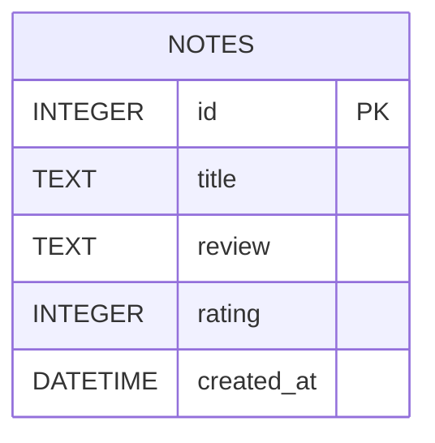

# 資料庫設計文件 - 讀書筆記系統

本文件根據產品需求文件 (PRD) 與系統架構文件 (ARCHITECTURE) 定義讀書筆記系統的資料庫結構。

## 1. ER 圖（實體關係圖）

為了符合 MVP 快速開發的需求，我們採用單一資料表設計，將書籍基本資訊與個人心得合併儲存在 `notes` 資料表中。

## 2. 資料表詳細說明

### `notes` (讀書筆記表)

負責儲存使用者的每一筆讀書筆記與書籍資訊。

| 欄位名稱 | 資料型別 | 屬性 | 說明 |
| :--- | :--- | :--- | :--- |
| `id` | INTEGER | PRIMARY KEY, AUTOINCREMENT | 筆記的唯一識別碼 |
| `title` | TEXT | NOT NULL | 書名 |
| `review` | TEXT | NULL | 閱讀心得或筆記內容 |
| `rating` | INTEGER | NULL | 對書籍的評分 (1 ~ 5) |
| `created_at` | DATETIME | DEFAULT CURRENT_TIMESTAMP | 筆記建立時間 |

*註：由於目前系統為單一使用者 MVP，因此暫無 `user_id` 作為 Foreign Key 關聯。*
