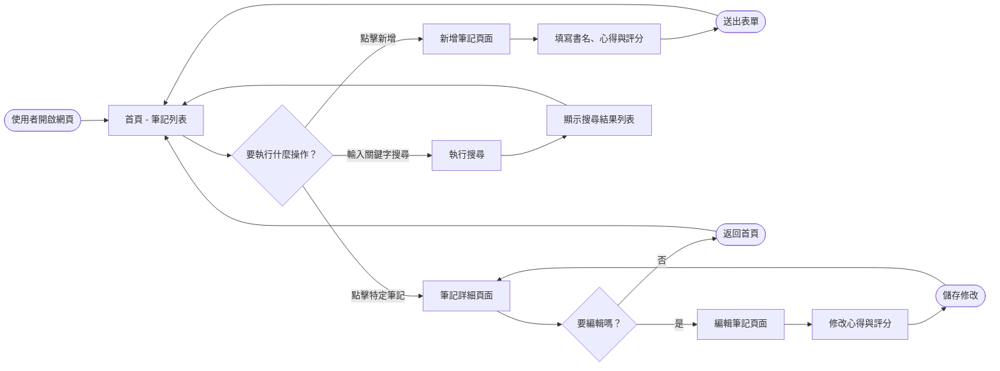
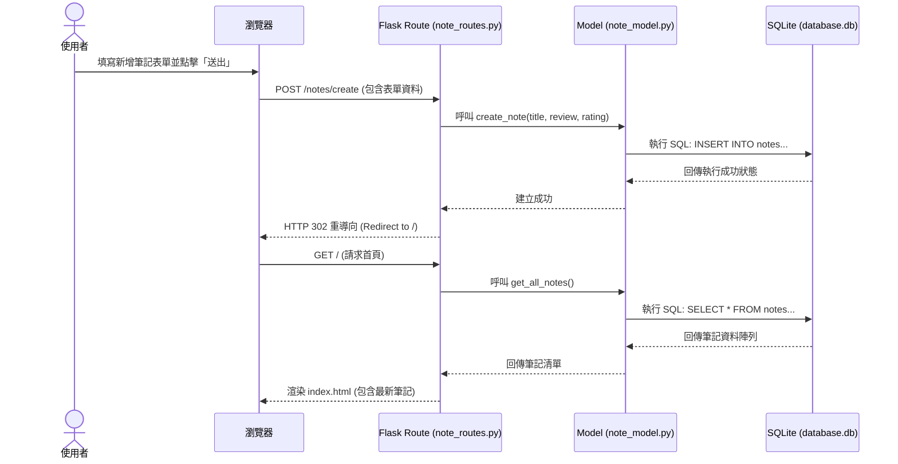

# 流程圖文件 - 讀書筆記系統

本文件根據產品需求文件 (PRD) 與系統架構文件 (ARCHITECTURE) 定義讀書筆記系統的使用者流程與系統互動流程。

## 1. 使用者流程圖 (User Flow)

此流程圖展示使用者在系統中的操作路徑，涵蓋首頁瀏覽、新增筆記、查看細節與搜尋等主要功能。

---

## 2. 系統序列圖 (Sequence Diagram)

此序列圖描述使用者執行「新增筆記」時，系統各元件之間的完整資料傳遞流程。

---

## 3. 功能清單對照表

以下整理主要功能所對應的 URL 路徑、HTTP 方法與負責的頁面/動作。

| 功能描述 | HTTP 方法 | URL 路徑 | 負責的模板 / 動作說明 |
| :--- | :--- | :--- | :--- |
| **首頁 / 筆記列表** | GET | `/` 或 `/notes` | `index.html` (顯示所有筆記) |
| **顯示新增頁面** | GET | `/notes/create` | `create.html` (顯示新增表單) |
| **處理新增資料** | POST | `/notes/create` | 處理表單後重導向至 `/` |
| **查看筆記細節** | GET | `/notes/<id>` | `detail.html` (顯示特定筆記) |
| **顯示編輯頁面** | GET | `/notes/<id>/edit` | `edit.html` (顯示編輯表單，可與 create.html 共用) |
| **處理編輯資料** | POST | `/notes/<id>/edit` | 處理修改後重導向至 `/notes/<id>` |
| **刪除筆記** | POST | `/notes/<id>/delete` | 處理刪除後重導向至 `/` |
| **搜尋筆記** | GET | `/search` | 根據 `?q=關鍵字` 渲染 `index.html` 的搜尋結果 |
